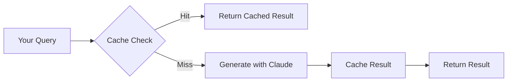

## The Simple Version

When your agent runs a task it's done before, Raysurfer returns the cached result instantly instead of regenerating it.

```
First run:  Your query → Code generated → Result cached → Code retrieved
Second run: Your query → Cache hit → Code retrieved (instant)
```

That's it. You don't need to manage anything.

{/* TODO: Replace the ASCII diagram above with a visual Mermaid diagram or image:


*/}

## Why This Works

Production agents in 2026 are running longer and longer. Multi-step workflows, complex tool chains, sprawling context windows. They're becoming difficult to context manage and behave consistently.

But here's the thing: **the median run has a typical shape.**

Despite all the complexity, most runs follow similar patterns. Raysurfer captures these patterns and guides the model to execute from the median run's starting point—editing that code file rather than regenerating it from scratch.

This gives you:

- **Better context management** — intermediate outputs between API calls or code functions aren't printed by default, keeping context clean
- **Consistent behavior** — the model starts from proven code instead of improvising each time
- **Faster execution** — skip the generation, go straight to the result

{/* TODO: Add a concrete example showing the "median run" concept:

### Example: The Median Run Pattern

Consider an agent that deploys services. Most deployments follow the same pattern:

```
1. Check service health
2. Pull latest config
3. Run deployment script
4. Verify deployment
5. Send notification
```

With Raysurfer, after a few successful runs, your agent retrieves proven code for each step instead of regenerating it. The "median run" becomes the template.
*/}

## What Gets Cached

Raysurfer automatically caches:

- Code outputs from your agent
- Generated documents and templates
- Structured data transformations

You don't need to tag or categorize anything. Raysurfer uses semantic matching to find similar past outputs.

## Quality Over Time

Raysurfer tracks which cached outputs work well:

- Outputs that succeed get prioritized
- Outputs that fail get deprioritized
- The system improves automatically

## Verified Snippets

Every cached output is verified before reuse:

- Only successful executions get cached
- Failed outputs are automatically excluded
- Your agent builds a library of proven code over time

{/* TODO: Explain how verification works in more detail:

### How Verification Works

<Steps>
  <Step title="Execution">
    Your agent runs and generates code output
  </Step>
  <Step title="Outcome Tracking">
    Raysurfer tracks whether the execution succeeded or failed
  </Step>
  <Step title="Scoring">
    Successful outputs get positive scores; failed outputs get negative scores
  </Step>
  <Step title="Reuse">
    Only outputs above a threshold score are returned for future queries
  </Step>
</Steps>

<Info>
  You don't need to manually mark outputs as good or bad. Raysurfer infers this from execution outcomes.
</Info>
*/}

{/* TODO: Add a section on semantic matching - this is a key differentiator:

## Semantic Matching

Raysurfer doesn't just do exact string matching. It uses embeddings to find semantically similar queries.

| Query | Matches Cache Entry |
|-------|---------------------|
| "Write a Python script to fetch weather data" | "Create a weather API client in Python" |
| "Parse JSON from an API response" | "Extract data from JSON API result" |

This means you get cache hits even when the wording is different but the intent is the same.
*/}

{/* TODO: Add technical details section for advanced users:

## Technical Details

<AccordionGroup>
  <Accordion title="Embedding Model">
    [TODO: What embedding model do you use? OpenAI? Custom?]
  </Accordion>
  <Accordion title="Cache Storage">
    [TODO: Where is the cache stored? Your servers? How is it secured?]
  </Accordion>
  <Accordion title="Cache TTL">
    [TODO: How long do cached entries live? Is this configurable?]
  </Accordion>
  <Accordion title="Privacy">
    [TODO: Is cached data shared across users? Or is it per-API-key?]
  </Accordion>
</AccordionGroup>
*/}

{/* TODO: Add a "Limitations" section to set expectations:

## Limitations

<Warning>
  Raysurfer works best for repetitive, pattern-based tasks. It's not ideal for:
</Warning>

- **Highly creative tasks** where uniqueness is important
- **Tasks with constantly changing inputs** (e.g., real-time data analysis)
- **One-off queries** that are unlikely to repeat

[TODO: Add any other limitations or edge cases users should know about]
*/}
